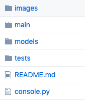
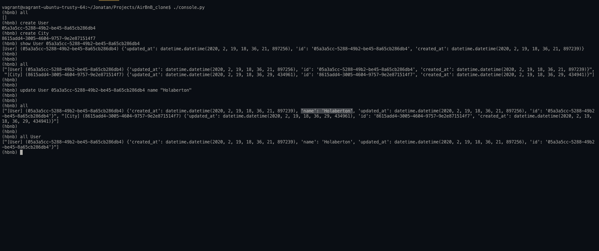

# AirBnB clone - The console


Project in which the base of the AirBnB clone will be created as a study method.

All knowledge acquired in python will be implemented, its base structure will be:
 - Create the basic classes where the most basic attributes will be saved, such as the time it was created and its respective ```ID```.
 - Create the basic methods that our interpreter will execute when we enter the commands corresponding to those methods.
 - Verify each of the functions so that they execute with all possible cases to avoid errors.
Each of these cases will be looked at later.

## First step: Write a command interpreter to manage your AirBnB objects:
 This is the first step towards building your first full web application: the AirBnB clone. This first step is very important because you will use what you build during this project with all other following projects: HTML/CSS templating, database storage, API, front-end integration…

 Each task is linked and will help you to:
  - put in place a parent ```class (called BaseModel)``` to take care of the initialization, serialization and deserialization of your future instances
  - create a simple flow of serialization/deserialization: ```Instance <-> Dictionary <-> JSON string <-> file```
  - create all classes used for AirBnB ```(User, State, City, Place…)``` that inherit from ```BaseModel```
  - create the first abstracted storage engine of the project: ```File storage```.
  - create all ```unittests``` to validate all our classes and storage engine
## What’s a command interpreter?
A command interpreter is the part of a computer operating system that understands and executes commands that are entered interactively by a human being or from a program. In some operating systems, the command interpreter is called the shell. But limited to a specific use-case. In our case, we want to be able to manage the objects of our project:
 - Create a new object (ex: a new ```User``` or a new ```Place```)
 - Retrieve an object from a file, a database etc…
 - Do operations on objects (```count```, compute stats, etc…)
 - ```Update``` attributes of an object
 - ```Destroy``` an object

## Technologies:
In this project we used ```Python 3.4``` and was verified with ```pep8 1.7```

We import this modules to create the console:
 - import cmd
 - import sys
 - import json
 - import subprocess

## Launch this Console:
How to run a project?

You only need to run ```console.py``` file with this command ```./console.py```

This command must be executed in the root folder of the project like:

```vagrant@vagrant-ubuntu-trusty-64:~/home/user/Documents/AirBnB_clone$ ./console.py```

make sure all files are in the root directory.



## Examples of use:
First you need to run the ```console.py```

Then you need to know the comands that the console can run:
 - ```all```: Prints all string representation of all instances based or not on the class name.

 sintax: ```all <class name>``` or ```all```
 - ```create```: Creates a new instance of ```BaseModel```, saves it (to the JSON file) and prints the ```id```.

  sintax: ```create <class name>```
 - ```destroy```: Deletes an instance based on the class name and ```id``` (save the change into the JSON file).

 sintax: ```destroy <class name> <id>```
 - ```show```: Prints the string representation of an instance based on the class name and ```id```.

 sintax: ```show <class name> <id>```
 - ```update```: Updates an instance based on the class name and ```id``` by adding or updating attribute (save the change into the JSON file).

 sintax: ```update <class name> <id> <attribute name> "<attribute value>"```
If you need more info type: ```(hbnb) ?```or ```(hbnb) help```.

Take from examples what you see in the follow image:


## Inspiration:
Project provided by [Holberton](https://www.holbertonschool.com)

## By:
[Cristian Gomez](https://twitter.com/cristianfg1702) - 
[Jonatan Mazo](https://twitter.com/JonatanRMC)
